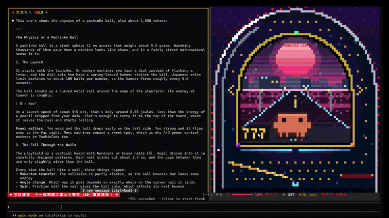

# PachinCode

Play pachinko while Claude writes your long answers and code.

[](LICENSE)
[](https://claude.com/claude-code)




PachinCode is a [Claude Code](https://claude.com/claude-code) mod. It puts a pixel-art pachinko machine in your terminal. Every few characters Claude writes drop another ball into your tray (上皿). When the hold lamps fill up, you stop shooting and read the reply. Hit a 大当たり, switch to 右打ち to rack up points, and your next question can run in 確変.

## Features

- **Balls that follow the reply**: every prompt loads 30 balls, and every 4 characters Claude generates adds one more.
- **Real pachinko physics**: balls climb the launch rail, clear the top and bounce down through brass pins. A shot too weak to clear the rail rolls back (戻り球) and costs nothing.
- **Holds and 止め打ち**: four hold lamps (保留). Once they are full, any ball that goes in is lost, so stop shooting and use the spin to read what Claude just wrote.
- **LCD performances**: the central screen has its own scenes for normal play, 予告 (premonitions), リーチ and 大当たり, plus a day–night cycle and changing weather.
- **Three kinds of 大当たり**:

  | Kind | Digits | Rounds | Afterwards |
  |---|---|---|---|
  | プレミアム | 7-7-7 | 10 | 確変 |
  | 確変大当たり | odd | 8 | 確変 |
  | 通常大当たり | even | 5 | back to normal |

  Overall jackpot odds are 1/99, ten times better during 確変 (1/9.9).
- **右打ち and PachinPoints**: during a 大当たり the attacker (大入賞口) opens. Every ball you shoot right into it earns 15 points. Shooting right at any other time does nothing, and the machine tells you to go back to 左打ち.
- **Gold replies**: any reply Claude writes during a 大当たり gets a gold frame and a rainbow banner that stay with it for good.
- **Persistent state**: PachinPoints, 確変 and gold replies carry over between sessions.
- **Sound**: 15 synthesized WAV clips for launches, pins, spins, リーチ, 大当たり and more.

## Requirements

- Claude Code **2.1.288** or later. Function hooks are in early access and the API may change between releases.
- A terminal with true color (24-bit). Fullscreen mode at 110 columns or wider docks the machine beside the conversation.
- Sound:
  - Windows: Windows PowerShell 5.1 (built in)
  - macOS: Claude Code's own playback
  - Linux: no sound in the terminal yet

## Installation

### From the plugin marketplace

```
/plugin marketplace add xd3an/pachincode
/plugin install pachincode@pachincode
```

Restart Claude Code. The machine opens after your first prompt, or with `/pachinko`.

### From source

```bash
git clone https://github.com/XD3an/pachincode.git
claude --plugin-dir ./pachincode
```

Loaded this way, Claude Code watches the folder and reloads the plugin whenever you save.

## Usage

### Controls

| Action | How |
|---|---|
| Shoot | Hold the left mouse button on the machine, or click the machine once and press Space (tap for one ball, hold for continuous fire) |
| Power | `←` `→`, or the 「力−」「力＋」 buttons |
| 左打ち / 右打ち | `L` (30%) / `R` (95%) |
| Auto-fire on/off | `S` |

If your terminal does not report mouse clicks:

1. Press `ctrl+x` then `tab` in the prompt to hand the keyboard to the machine pane.
2. Use `S`, `F` (shoot), `A`, `D`, `L`, `R`, or click the buttons below the machine.
3. Press `Esc` to give the keyboard back to the prompt.

### Commands

| Command | What it does |
|---|---|
| `/pachinko` or `/pachinko on` | Open the machine |
| `/pachinko off` | Close the machine |
| `/pachinko mute` / `unmute` | Turn sound off / on |
| `/pachinko stats` | Show PachinPoints, balls fired and jackpots hit |

## Development

### Checks and tests

```bash
# Check the manifest and the hooks module
claude plugin validate .

# Type-check (.claude-plugin/types is written by Claude Code when it loads the plugin)
npx -p typescript tsc -p .

# Run the tests
claude plugin test .
```

### Regenerating sounds

```bash
node tools/make-sounds.mjs          # all clips
node tools/make-sounds.mjs pin warn # only the clips you name
```

On Windows the running player keeps the loaded WAV files open. Close the machine or quit Claude Code before overwriting them.

### Previewing without a terminal

```bash
npx esbuild hooks/game/index.ts --bundle --format=esm --outfile=/tmp/machine.mjs
MACHINE=file:///tmp/machine.mjs node tools/preview.mjs ./out 70 36
```

## Contributing

Issues and pull requests are welcome. Please run `claude plugin validate .` and `claude plugin test .` before opening a PR.

## License

[MIT](LICENSE)
